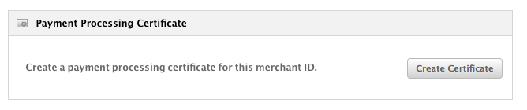
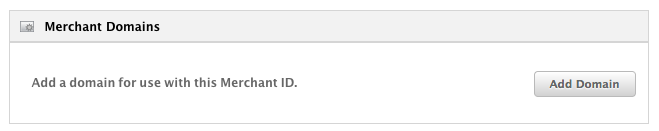
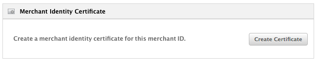

:exclamation: Deprecated! Use https://github.com/datatrans/payment-button

# Apple Pay Web Sample App
This small Spring Boot App demonstrates a basic Apple Pay Web integration with Datatrans.
Use it as a step by step guide to get started with Apple Pay on the web.

3. Java installed on your local dev system
4. `openssl` installed on your local dev system
5. A domain (for example my-shop.com or the one Heroku assigns to you)
6. An iPhone or MacBook with Touchbar supporting Apple Pay
7. A credit card from an issuer (bank) supporting Apple Pay

## Initial Apple Pay Web setup
1. [Create a new identifier (Merchant ID)](https://developer.apple.com/account/resources/identifiers/add/bundleId) at developer.apple.com
2. Click on the 'Edit' button of the newly created Merchant ID
3. Here you see 3 'boxes'
   1. Payment Processing Certificate
   
      
   
      ```zsh
      openssl ecparam -out pmnt-process.key -name prime256v1 -genkey
      openssl req -new -key pmnt-process.key -out pmnt-process.csr -sha256
      ```  
   2. Merchant Domains

      
         
   3. Merchant Identity Certificate
      
      
      
      This is the certificate you need to make a connection from your server to apple to do the merchant validation.
      **Do not** re-use the CSR from above here. Instead, create your own:
      
      ```zsh
      openssl genrsa -out apple-pay.key 2048
      openssl req -new -key apple-pay.key -out apple-pay.csr      
      ```
      
      Use `apple-pay.csr` to create your merchant identity certificate on developer.apple.com.
      
      Convert the downloaded merchant identity certificate to `.pem`
      
      ```zsh
      openssl x509 -inform der -in certFromApple.cer -out merchant_identity_cert.pem
      ```
      
      And finally create a `.p12` file
      
      ```zsh
      openssl pkcs12 -export -in merchant_identity_cert.pem -inkey applepaytls.key -out apple-pay.p12 -name "Datatrans Showcase ApplePay key"
      ```
            
## Prepare the sample application
    
1. Put the `apple-pay.p12` file into folder `src/main/resources/tls`
2. Add `-Djavax.net.ssl.keyStore=src/main/resources/tls/apple-pay.p12 -Djavax.net.ssl.keyStorePassword=$KEYSTORE_PASSWORD -Djavax.net.ssl.keyStoreType=PKCS12`
3. Adjust the `application.properties` in `src/main/resources`
    
    
### Testing

    
1. This is a free text label of a line item indicating that this is 'only' a registration
### Remarks
- The client side code in `src/main/resources/static` is a 1:1 copy from the
[Apple Pay Web Demo](https://applepaydemo.apple.com) with some basic changes.


        
    
